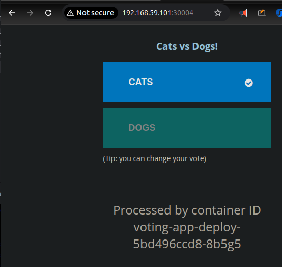

# kubernetes setup using deployments and services


In this example instead of using the most basic components (pods & services) services will be created using deployments.
Compared to the previous example ([k8s-specifications-pods-and-services](./../k8s-specifications-pods-and-services))
the services will be reused without any changes.

## Comparing pods to deployments
Basic pod structure:
```yaml
apiVersion: v1
kind: Pod
metadata:
  <some-pod-name>
  <some-pod-labels>
spec:
  <some-pod-spec>
```

Pod is the simplest building block in Kubernetes.
It is managed directly by the user (if not part of a higher-level object like a Deployment).
If a Pod fails it is not automatically replaced unless managed by a higher-level object.

Basic deployment structure:
```yaml
apiVersion: apps/v1
kind: Deployment
metadata:
  name: example-deploy
  labels:
    name: example-deploy
    app: demo-voting-app
spec:
  replicas: 1
  selector:
    matchLabels:
      <some-pod-labels> # matchLabels and labels in template should be the same
  template:
    metadata:
      <some-pod-name>
      <some-pod-labels> # matchLabels and labels in template should be the same
    spec:
      <some-pod-spec>
```

Deployment is a higher-level Kubernetes object that manages Pods and 
ensures that a specified number of replicas of a Pod are running at any given time.
Automatically recreates Pods if they fail or the underlying nodes crash.
Provides declarative updates to applications (rolling updates, rollbacks).
Handles scaling, self-healing, and maintaining a desired state.

## Testing scalability
In current setup all replicas are set to 1. After running:
```shell
kubectl scale deployment voting-app-deploy --replicas=3
```
The number of replicas increases:
```shell
kubectl get deployments voting-app-deploy -o wide
```
```text
NAME                READY   UP-TO-DATE   AVAILABLE   AGE   CONTAINERS   IMAGES                                SELECTOR
voting-app-deploy   3/3     3            3           26m   voting-app   dockersamples/examplevotingapp_vote   app=demo-voting-app,name=voting-app-pod
```

Now when using voting app UI after each refresh at the bottom of the page ID of the container changes.


